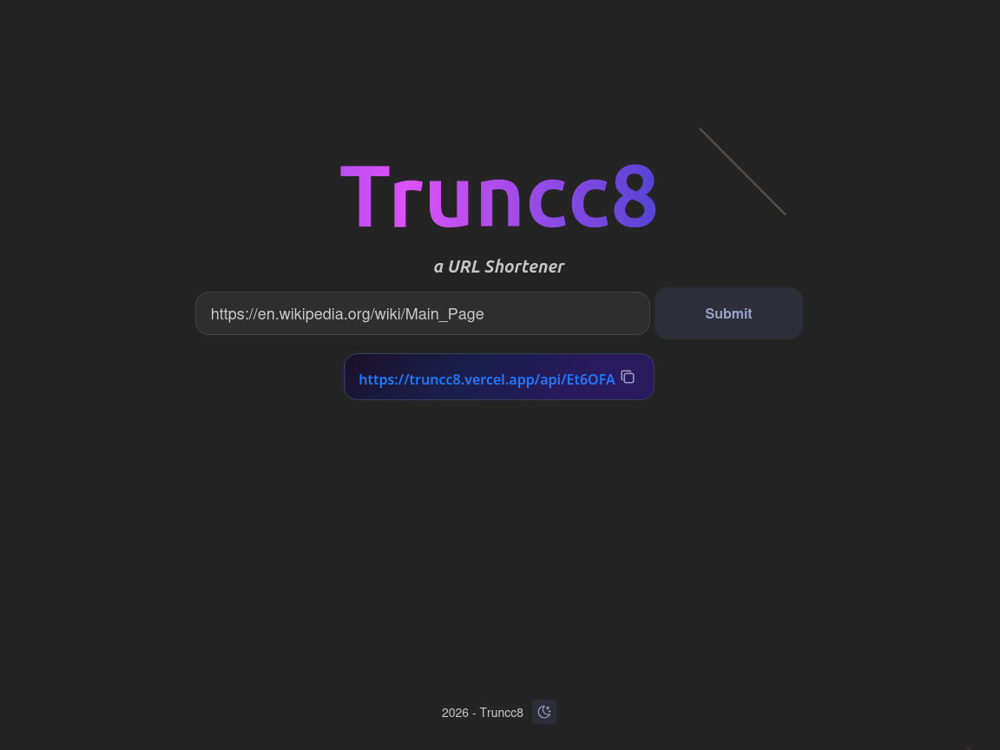

# Trunnc8 -- A URL Shortener

A simple url shortener web app written in TypeScript.



## 🚀 Features

- **Shorten URLs**
- **URL Validation**
- **Automatic Redirects**
- **Clean User Interface**
- **Copy to Clipboard**

## 🛠️ Tech Stack

- **Backend**: Node.js, Express.js
- **Database**: MongoDB with Mongoose ODM
- **Frontend**: React
- **UI**: Mantine UI

## 📋 Requirements

To run this application, you need:

- [Node.js]
- [MongoDB] installed and running locally, or a MongoDB Atlas account
- [NPM] package manager

## Installation & Setup

### 1. Clone or Download the Project

```bash
# navigate to the project directory
cd truncc8
```

### 2. Install Dependencies

```bash
# install frontend dependencies
cd client
npm install
```

```bash
# install backend dependencies
cd api
npm install
```

### 3. Environment Configuration

Create a `.env` file in the /api directory:

```env
MONGODB_URI=[MONGODB_URI GOES HERE] (LOCAL or REMOTE)
```

### 4. Running the Application

```bash
# running frontend
cd frontend
npm run dev

# running backend
cd api
node index.js
```

The frontend will be available at `http://localhost:5173`

The backend will be available at `http://localhost:3000`

## 📁 Project Structure

```
truncc8/
├── client/                # Frontend files
│   ├── index.html         # Main HTML file
│   ├── package.json       # Dependencies and scripts
│   ├── src/               # React application
│   └── public/            # Media files
├── api/                   # Frontend files
│   ├── index.js           # Express server 
│   ├── package.json       # Dependencies and scripts
│   ├── url.js             # MongoDB schema
│   ├── .env               # Environment variables (YOU SUPPLY THIS)
└── README.md              # This file
```

## 🔌 API Endpoints

### POST `/api/shorten`
creates a shortCode from a given URL.

**Request Body:**
```json
{
  "url": "https://www.test.com/path"
}
```

**Response:**
```json
{
  "shortCode": "abc123"
}
```

### GET `/:shortcode`
Redirects to the original URL associated with a shortCode.

## 📝 License

This project is licensed under the MIT License.